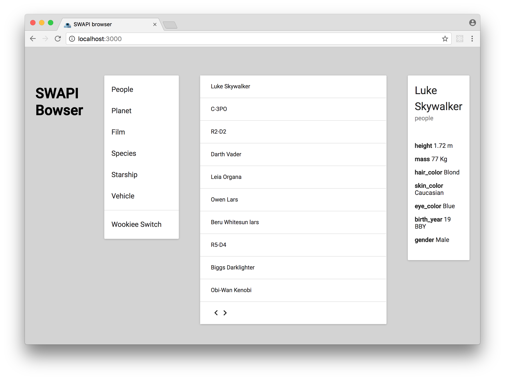

*Created with [create-react-app](./README\create-react-app.md)*

# Test

#### Live

[Try the app here](http://camillegabrieli.com/swapi_browser/)

#### Local

1. 'npm install'
2. 'npm start'

# Goal

This app is a job test to work at Famoco.
It's supposed to let me show my React competences. However as I never used it before, I take it as an opporunity to show my capacity to struggle and learn.

>Star Wars API - Browse Page

>In this test, you will develop a React app using Material Design(Material-UI) and The Star Wars API (https://swapi.co).

>Your app should browse the API resources in a data table(pagination) with a brief description(max 5 columns) and when the user clicks in one of the rows, you need to show the full description of the item.

# TODO

- ~~Use [stateless components pattern](https://medium.com/@housecor/react-stateless-functional-components-nine-wins-you-might-have-overlooked-997b0d933dbc)~~
- ~~Add PropTypes~~
- fix divider problem on top of wookie switch ~~and on top of data table arrows~~
- Change State of categories and entries from containing data (and process in render function) to containing result to render (and process async in componentwillmount)
-  Implement Cache for cat items (fetch next and previous items in advence ? / strore direcly the object instead of link)
-  No loading with table updating
-  In AppTable, group entries, linkNext and linkPrevious states in an object
-  Make selected cat/table appear selected
-  Use fetch() instead of axios ?
-  implements [wookiee translator](http://swapi.co/documentation#wookiee) => In progree in 'feat/wookiee' branch
-  Make the title as top bar ?
-  Style
-  get rid of Table element to use the same style as menu ? (but table is asked by the job test)
-  Bind Details links to app currentItem state
-  Auto Fetch pictore on google image based on name

# Notes

https://fr.pinterest.com/camillegabrieli/data-tables/
